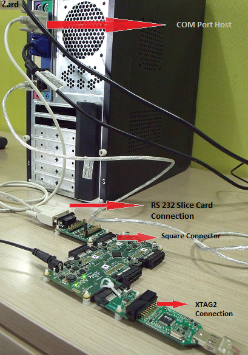
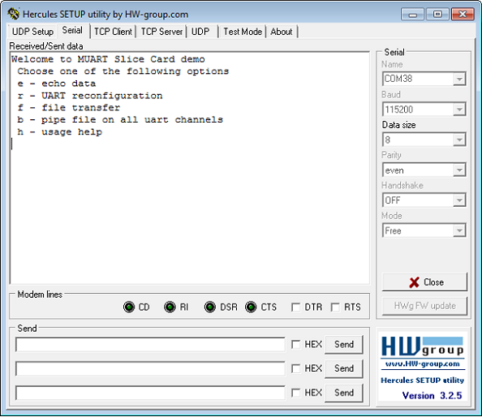
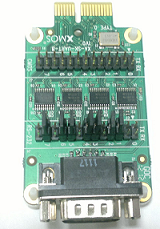

Multiuart Com Demo: Quick Start Guide
--------------------------------------------------

We use the XA-SK-UART8 Multi UART Slice Card together with the xSOFTip multi UART software to create a UART, and send data to and from a PC COM port. This application showcases some of the software key features and serves as an example on how to use its API. This demo features UART reconfiguration for various standard baud rates, receives bulk data via file uploads, and perform integrity checks on data before sending it back to COM port.

Install Demon Tools on the Host PC
+++++++++++++++++++++++++++++++++++

The following tools should be installed on the host system in order to run this application

    * For Win 7: Hercules Setup Utility by HW-Group
      http://www.hw-group.com/products/hercules/index_en.html
    * For MAC users: SecureCRT7.0 
      http://www.vandyke.com/download/securecrt/

Hardare Setup
++++++++++++++
The XP-SKC-L2 Slicekit Core board has four slots with edge conectors: ``SQUARE``, ``CIRCLE``, ``TRIANGLE`` and ``STAR``. 

To setup up the system refer to the figure and instructions below 

   #. Connect XA-SK-MUART Slice Card to the XP-SKC-L2 Slicekit Core board using the connector marked with the ``SQUARE``.
   #. To change it to slot ``STAR`` simply define in main.xc file ``#define SK_MULTI_UART_SLOT_STAR 1`` and connect to appropriate slot in the Slice kit core Board Hardware. 
   #. Connect the XTAG Adapter to Slicekit Core board, and connect XTAG-2 to the adapter. 
   #. Connect the XTAG-2 to host PC. Note that a USB cable is not provided with the Slicekit starter kit.
   #. Switch on the power supply to the Slicekit Core board.
   #. Connect a null serial cable to DB-9 connector on XA-SK-MUART Slice Card. The cable will need a cross over between the UART RX and TX pins at each end.
   #. Connect other end of cable to Host DB-9 connector slot. If the Host does not have an DB-9 Connector slot then use USB-UART cable for the demo. We used the BF-810 USB to Uart adapter (See http://www.bafo.com/products_bf-810_S.asp (Part number : BF-810). Any other usb to uart bridge should do just as well.
   #. Identify the serial (COM) port number provided by the Host or the USB to UART adapter and open a suitable terminal software for the selected serial port (refer to the Hercules or SecureCRT documentation above).
   #. Configure the host terminal console program as follows: 115200 baud, 8 bit character length, even parity, 1 stop bit, no hardware flow control. The Transmit End-of-Line character should be set to `CR` (other options presented will probably be `LF` and `CR\LF`).
   #. Connect XA-SK-MUART Slice Card to the XP-SKC-L2 Slicekit Core board. 
   #. Connect the XTAG Adapter to Slicekit Core board, XA-SK-XTAG2 connector(xtag slice) and connect XTAG-2 to the adapter. 
   #. Connect the XTAG-2 to host PC.
   #. Switch on the power supply to the Slicekit Core board.
   #. Open the serial device on the host console program
   

Import and Build the Application
++++++++++++++++++++++++++++++++

   #. Open xTimeComposer and check that it is operating in online mode. Open the edit perspective (Window->Open Perspective->XMOS Edit).
   #. Locate the ``'Slicekit COM Port MUART Demo'`` item in the xSOFTip pane on the bottom left of the window and drag it into the Project Explorer window in the xTimeComposer. This will also cause the modules on which this application depends (in this case, sc_util) to be imported as well. 
   #. Click on the Slicekit COM Port MUART Demo item in the Explorer pane then click on the build icon (hammer) in xTimeComposer. Check the console window to verify that the application has built successfully.

For help in using xTimeComposer, try the xTimeComposer tutorial. FIXME - link?

Note that the Developer Column in the xTimeComposer on the right hand side of your screen provides information on the xSOFTip components you are using. 

Use of Software
++++++++++++++++

   #. Open the XDE
   #. Choose *Run* |submenu| *Run Configurations*
   #. Double-click *XCore Application* to create a new configuration
   #. In the *Project* field, browse for `app_sk_muart_com_demo`
   #. In the *C/C++ Application* field, browse for the compiled XE file
   #. Ensure the *XTAG-2* device is selected in the `Target:` adapter list
   #. Click **Run**

Demo Application
++++++++++++++++

   #. Select and Open the configured terminal client application console
   #. Upon any key press on console, a user menu is displayed
   #. Key in ``e``. Type in any character from the key board and application echoes back pressed keyed. In order to get back to user menu, press ``Esc`` key
   #. Key in ``r``. UART enters into reconfiguration mode and listens for new baud rate. Key in new baud rate value (select one of the values from 115200, 57600, 38400, 19200, 9600, 4800, 600) followed by CR (Enter) key. Upon successful reconfiguration, terminal console should be opened on the selected baud rate configuration. Press ``h`` to display user menu
   #. Key in ``g`` to upload a file from console. Before uploading a file, navigate to ``test`` directory and execute crc_appender application as *crc_appender <file_name>* This appends a CRC value calculated for the file contents. Once a selected file is uploaded, press CTRL+D. Application now listens for any user commands. If any key other than ``p`` is pressed, all the uploaded file contents are lost. A sample file ``output_file.txt`` is available in the ``test\crc_appender`` director of the repository which can be used straight away without running CRC appender host application.
   #. Key in ``p`` in order to display the uploaded file contents on the console. In case of any CRC mismatch, an error message is displayed. If this option is selected prior to using ``g`` option, an error message is displayed
   #. Key in ``h`` in order to display user menu. This help is displayed any time during execution by pressing ``Esc`` key followed by ``h`` 

   Screenshot of Hyperterminal window
   
   #. Key in ``b`` in order to pipe data to all uart channels. Hardware setup for Pipe option should be shown as below, loop all the Uart channels(like Channel 7 Shown in the figure) except channel 0. Send data from the terminal and you will see data received back passing through all channels. If the connection to any of the channel is disconnected you will not see data received back. Send a file and press ``CTRL+D``, sent data is received back by passing through all channels with timing information.   

   
   Hardware setup for Pipe option

Short the following Pins in CMOS section or in RS-232 section of the  Muart Slice Card (XA-SK-MUART Slice Card). [Header-J3 (or) Header-J4 respectively]

.. list-table::
    :header-rows: 27
    
    * - TX
      - RX
    * - 5 
      - 6 
    * - 7 
      - 8
    * - 11 
      - 12
    * - 13
      - 14
    * - 17
      - 18
    * - 19
      - 20
    * - 23
      - 24
      
Next Steps
++++++++++

   #. Refer to the module_multi_uart documentation for implementation details of this application and information on further things to try.
   #. Evaluate the full Ethernet to Serial (8 Uart) reference product which can be found at https://github.com/xcore/sw_serial_to_ethernet. This is a fully featured reference product including an embedded webserver, multicast configuration via UDP and a host of other features. 

Look at the Code
................

   #. Examine the application code. In xTimeComposer navigate to the ``src`` directory under app_sk_muart_com_demo and double click on the main.xc file within it. The file will open in the central editor window.
   #. This code demostrates about simple Muart demo application and usage of muart component.

More complex Serial Bridging Applications
.........................................

This application uses 8 UART channels. Take a look at the Serial to Ethernet Bridging application which uses Muart Component. Have a look at the documentation for that component and how its API differs from the stand alone Uart. 

This application offers many features including dynamic reconfiguration, an embedded webserver and 8 uarts running up to 115KBaud.
