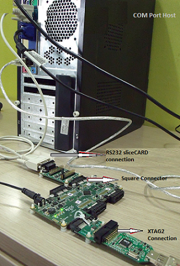

module_multi_uart Com Port Demo: Quick Start Guide
--------------------------------------------------

We use the XA-SK-UART8 Multi UART Slice Card together with the xSOFTip multi UART software to create a UART, and send data to and from a PC COM port. This application showcases some of the software key features and serves as an example on how to use its API. This demo features UART reconfiguration for various standard baud rates, receives bulk data via file uploads, and perform integrity checks on data before sending it back to COM port.

Build the Application
+++++++++++++++++++++

The following components are required to build ``app_slicekit_com_demo`` application or develop sample Multi-UART applications:
    * sc_multi_uart: git://github.com/xcore/sc_multi_uart.git
    * sc_util: git://github.com/xcore/sc_util.git
    * xcommon: git://github.com/xcore/xcommon.git (Optional)

   #. Clone the above repositroes or download them as zipfile packages.
   #. Open the XDE (XMOS Development Tools - latest version as of this writing is 11.11.1) and Choose `File` |submenu| `Import`.
   #. Choose `General` |submenu| `Existing Projects into Workspace` and click **Next**.
   #. Click **Browse** next to `Select archive file` and select the first firmware ZIP file.
   #. Click **Finish**.
   #. Repeat the import process for the remaining zipfiles.
   #. To build, select `app_slicekit_com_demo` from `sc_multi_uart` folder in the Project Explorer pane and click the **Build** icon.   

Install Demonstration Tools on the Host PC
++++++++++++++++++++++++++++++++++++++++++

The following tools should be installed on the host system in order to run this application

    * For Win 7: Hercules Setup Utility by HW-Group
      http://www.hw-group.com/products/hercules/index_en.html
    * For MAC users: SecureCRT7.0 
      http://www.vandyke.com/download/securecrt/

Set Up The Hardare
++++++++++++++++++

   [**FIXME: To add a subsection listing the hardware required, with links to their product pages on XMOS.com]

   Demonstration Hardware Setup

   #. Connect XA-SK-UART8 Slice Card to the XP-SKC-L2 Slicekit Core board. This Slice Card can be connected to either ``Square``, ``Tringle`` or ``Star`` connector of Slicekit Core board, but for now, use the SQUARE slot as shown in the figure above
   #. Connect COM port cable (provided with XA-SK-UART8 Slice Card package) to DB-9 connector on XA-SK-UART8 Slice Card. This enables UART 0 by default
   #. Connect other end of cable to Host (PC) DB-9 connector slot
   #. Identify COM port number provided by the Host and open a suitable terminal software for the selected COM port (refer to the Hercules or SecureCRT documentation above) for default parameters which are as follows: 115200 baud, 8 bit character length, even parity config, 1 stop bit and no hardware flow control  
   #. Connect the XTAG Adapter to Slicekit Core board, Chain connector and connect XTAG-2 to the adapter. 
   #. Connect the XTAG-2 to host PC or Mac USB port.
   #. Switch on the power supply to the Slicekit Core board.

Use the Software
++++++++++++++++

   #. Open the XDE
   #. Choose *Run* |submenu| *Run Configurations*
   #. Double-click *XCore Application* to create a new configuration
   #. In the *Project* field, browse for `app_slicekit_com_demo`
   #. In the *C/C++ Application* field, browse for the compiled XE file
   #. Ensure the *XTAG-2* device is selected in the `Target:` adapter list
   #. Click **Run**

Do the Demo
+++++++++++

   #. Select and Open the configured terminal client application console
   #. Upon any key press on console, a user menu is displayed
   #. Key in ``e``. Type in any character from the key board and application echoes back pressed keyed. In order to get back to user menu, press ``Esc`` key
   #. Key in ``r``. UART enters into reconfiguration mode and listens for new baud rate. Key in new baud rate value (select one of the values from 115200, 57600, 38400, 19200, 9600, 4800, 600) followed by CR (Enter) key. Upon successful reconfiguration, terminal console should be opened on the selected baud rate configuration. Press ``h`` to display user menu
   #. Key in ``g`` to upload a file from console. [**FIXME This CRC appender feature is yet to be added:** Before uploading a file, navigate to ``test`` directory and execute crc_appender application as *crc_appender <file_name>* This appends a CRC value calculated for the file contents]. Once a selected file is uploaded, press CTRL+D. Application now listens for any user commands. If any key other than ``p`` is pressed, all the uploaded file contents are lost **[FIXME Sample file, CRC application is yet to be tested and added into the repo]**
   #. Key in ``p`` in order to display the uploaded file contents on the console. [**FIXME CRC feature + error message to be added**] In case of any CRC mismatch, an error message is displayed. If this option is selected prior to using ``g`` option, an error message is displayed
   #. Key in ``h`` in order to display user menu. This help is displayed any time during execution by pressing ``Esc`` key followed by ``h`` 

   Screenshot of Hyperterminal window
    
Next Steps
++++++++++

   #. Refer to the module_multi_uart documentation for implementation details of this application and information on further things to try.
   #. Evaluate the full Ethernet to Serial (8 Uart) reference product which can be found at https://github.com/xcore/sw_serial_to_ethernet. This is a fully featured reference product including an embedded webserver, multicast configuration via UDP and a host of other features. 
