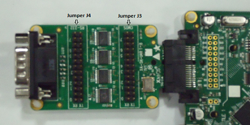

Example Applications
====================

This section discusses the demonstration application that uses multi-uart module.

**app_sk_muart_com_demo** Application
~~~~~~~~~~~~~~~~~~~~~~~~~~~~~~~~~~~~~

This application is available as ``app_sk_muart_com_demo`` under ``sc_multi_uart`` component directory. See the evaluation platforms section of this document for required hardware.
    
.. _sec_demo_tools:

Required Software Tools
-----------------------

The following tools should be installed on the host system in order to run this application

    * For Win 7: Hercules Setup Utility by HW-Group
      http://www.hw-group.com/products/hercules/index_en.html
    * For MAC users: SecureCRT7.0 
      http://www.vandyke.com/download/securecrt/

.. _sec_slice_card_connection:

Build options
--------------

``app_sk_muart_com_demo`` application uses the following modules in order to achieve its desired functionality.

    * **sc_multi_uart**: utilizes TX and RX servers provided by the component
    * **sc_util**: uses ``module_xc_ptr`` functions to perform pointer related arithmetic such as reading from and writing into memory

This demo application is built by default for XP-SKC-L2 Slicekit Core board, SQUARE connector type. This application can also be built for TRIANGLE or STAR connectors as follows:

To build for STAR connector, make the following changes in ``src\main.xc`` file:

    * Modify tile number from ``1`` to ``0``

To build for TRIANGLE connector, make the following changes in ``src\main.xc`` file:

    * Modify tile number from ``1`` to ``0``
    * Modify 8 bit port assignment of UART TX from ``XS1_PORT_8B`` to ``XS1_PORT_8D``
    * Modify 8 bit port assignment of UART RX from ``XS1_PORT_8A`` to ``XS1_PORT_8C``
    * Modify external clock refernce from ``XS1_PORT_1F`` to ``XS1_PORT_1L``

The module requires 8-bit ports for both UART transmit and UART receive ports. Upon selection of an appropriate type of connector, the port declarations for the multi-uart component are derived automatically.
    

Hardware Settings
-----------------

Voltage Levels
++++++++++++++

The XA-SK-UART8 Slice Card has two options for uart signalling levels:
    * CMOS TTL
    * RS-232
    
By default, this Slice Card uses the RS-232 levels. In order to use the CMOS TTL levels, short J3 pins (25-26) of the Slice Card. All 8 UART channels must use the same voltage setting. 

Uart Header Connections
+++++++++++++++++++++++

When using the RS-232 levels, UART device pins must be connected to J4 of XA-SK-UART8 Slice Card.

When using TTL levels, UART device pins must be connected to J3 of Multi-UART Slice Card (along with J3 25-26 pins shorted). UART information of XA-SK-UART8 Slice Card is as follows:

.. _table_connector_breakout:

XA-SK-UART8 Slice Card for Demo Applications 

=================== ===================== =====================
**UART Identifier** **J3/J4 Pin no.(TX)** **J3/J4 Pin no.(RX)**
=================== ===================== =====================
0                   1                     2
1                   5                     6
2                   7                     8 
3                   11                    12
4                   13                    14
5                   17                    18
6                   19                    20
7                   23                    24
=================== ===================== =====================

Optionally, Uart #0 may be accessed via the DB9 connector on the end of the Slice Card and thus connected directly to a PC COM port.

    
Application Description
-----------------------

The demonstration application shows a typical application structure that would employ the Multi-UART module. 

In addition to the two Multi-UART logical cores used by ``sc_multi_uart``, the application utilises one more logical core to manage UART data from transmit and receive logical cores. 

UART data received may be user commands or data related to a user command selection (see :ref:`sec_demo_features`).

The application provides some buffers (FIFO) to hold data received from UARTs. When the RX logical core receives a character over the UART, it signals application handler to process the data. Appliaction receive handler validates the data and performs specific actions.

Generally, the data token received by RX buffering logical core tells which UART channel a character has been received on. The logical core then extracts this character out of the buffer slot, validates it utilising the provided validation function and inserts it into a larger, more comprehensive buffer.The RX buffering is implemented as an example only and may not be necessary for other applications. The TX logical core already provides some buffering supported at the component level. 

The TX handler operates by polling the buffer when it has to transmit data related to any UARTS. 

The channel for the TX logical core is primarily used for reconfiguration. This is discussed in more detail in :ref:`sec_reconf_rxtx`. Specific usage of the API is also discussed in :ref:`sec_interfacing_tx` and :ref:`sec_interfacing_rx`.

.. _sec_demo_usage:

Quick Start Guide
-----------------

Quick starter guide and application usage is available in ``doc_quickstart`` of the application.

.. _sec_demo_features:

Interacting with the Application
--------------------------------

Command Interface
+++++++++++++++++

The application provides the following commands to interact with it:

    * e - in this mode, an entered character is echoed back on the console
    * r - reconfigure UART for a different baud rate
    * f - transfer a file using a single UART
    * b - pipe file through all uart channels
    * h - displays user menu
    
    In order to come out of a selected mode, press the ``Esc`` key.
    At any instance ``Esc`` key can be pressed to revert back to user menu.

Makefiles
---------

The main Makefile for the project is in the application directory. This file specifies build options and used modules. The Makefile uses the common build infrastructure in ``xcommon``. This system includes the source files from the relevant modules and is documented within ``xcommon``.

Using Command Line Tools
------------------------

To build from the command line, change to `app_slicekit_com_demo` directory and execute the command:

   ::

       xmake all

Open the XMOS command line tools (Desktop Tools Prompt) and execute the following command:

   ::

       xflash <binary>.xe

