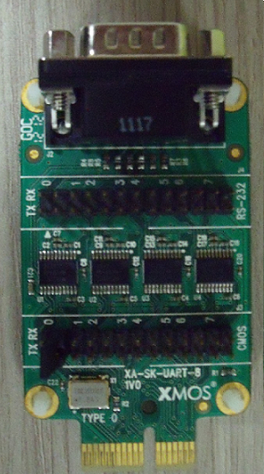

Evaluation platforms
====================

Recommended hardware
--------------------

This module may be evaluated using the sliceKIT modular development platform, available from digikey. Required boards are:

   * XP-SKC-L16 plus XA-SK-UART8 plus XA-SK-XTAG2 (Slicekit XTAG-2 adaptor) plus XTAG2 (debug adaptor)

XA-SK-UART8 sliceCARD
---------------------

Demonstration application
-------------------------

Example usage of this module can be found within the xSOFTip suite as follows:

   * Package: sc_multi_uart
   * Application: app_sk_muart_com_demo
