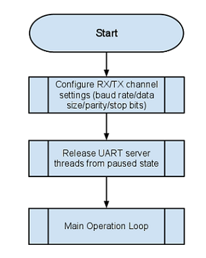

Programming Guide
==================

This section discusses the programming aspects of the Multi-UART component and typical implementation and usage of the API.

Structure
~~~~~~~~~~

This is an overview of the key header files that are required, as well as the logical core structure and information regarding the buffering provision and requirements for the component.

Source Code
++++++++++++

All of the files required for operation are located in the ``module_multi_uart`` directory. The files that are need to be included for use of this component in an application are:

.. list-table::
    :header-rows: 1
    
    * - File
      - Description
    * - ``multi_uart_rxtx.h``
      - Header file for simplified launch of both the TX and RX server logical cores, also provides the headers for the individual RX and TX API interfaces.
    * - ``multi_uart_common.h``
      - Header file providing configuration ENUM definitions and other constants that may be required for operation
    * - ``multi_uart_rx.h``
      - Header file for accessing the API of the RX UART server - included by ``multi_uart_rxtx.h``
    * - ``multi_uart_tx.h``
      - Header file for accessing the API of the TX UART server - included by ``multi_uart_rxtx.h``

Configuration of Multi-UART component
~~~~~~~~~~~~~~~~~~~~~~~~~~~~~~~~~~~~~

Multi-UART component configuration takes place in two domains - a static compile time configuration (discussed in this section) and a runtime dynamic configuration (as discussed in :ref:`sec_initialisation` and :ref:`sec_reconf_rxtx`. 

Static configuration is done by the application providing configuration header files ``multi_uart_tx_conf.h`` and ``multi_uart_rx_conf.h``. 

.. _sec_tx_conf_header:

Static configuration of UART TX
++++++++++++++++++++++++++++++++

Below is a summary of the configuration options that are in the ``multi_uart_tx_conf.h`` file, their suggested defaults and an explanation of their function.

.. list-table::
    :header-rows: 1
    
    * - Define
      - Default
      - Other options
      - Explanation
    * - UART_TX_USE_EXTERNAL_CLOCK
      - (None)
      - Not defined
      - The presence of this define turns on or off the requirement to use external clocking this is discussed in :ref:`sec_ext_clk`.
    * - UART_TX_CLOCK_RATE_HZ
      - 1843200 | 100000000
      - Any valid clock rate
      - Defines the clock rate that the baud rates are derived from
    * - UART_TX_MAX_BAUD_RATE
      - 115200
      - less than or equal to 115200
      - Define the max baud rate the API will allow configuration. Validated to 115200
    * - UART_TX_CLOCK_DIVIDER
      - (UART_TX_CLOCK_RATE_HZ / UART_TX_MAX_BAUD_RATE)
      - Any appropriate divider
      - It is recommended to leave this at the default. Is used to set the clock divider when configuring clocking from the internal reference clock
    * - UART_TX_OVERSAMPLE
      - 2
      - {1|2}
      - Define the oversampling of the clock - this is where the UART_TX_CLOCK_DIVIDER is > 255 (otherwise set to 1) - only used when using an internal clock reference
    * - UART_TX_BUF_SIZE
      - 16
      - {1,2,4,8,16,32,...}
      - Define the buffer size in UART word entries - needs to be a power of 2 (i.e. 1,2,4,8,16,32)
    * - UART_TX_CHAN_COUNT
      - 8
      - {1,2,4,8}
      - Define the number of channels that are to be supported, must fit in the port. Also, must be a power of 2 (i.e. 1,2,4,8) - not all channels have to be utilised
    * - UART_TX_IFB
      - 0
      - {0..n}
      - Define the number of interframe bits - n should not make the total number of bits in a UART word exceed 32
      
Static configuration of UART RX
++++++++++++++++++++++++++++++++

Below is a summary of the configuration options that are in the ``multi_uart_rx_conf.h`` file, their suggested defaults and an explanation of their function.

.. list-table::
    :header-rows: 1

    * - Define
      - Default
      - Other options
      - Explanation
    * - UART_RX_CHAN_COUNT
      - 8
      - {1,2,4,8}
      - Define the number of channels that are to be supported, must fit in the port. Also, must be a power of 2 (i.e. 1,2,4,8) - not all channels have to be utilised
    * - UART_RX_CLOCK_RATE_HZ
      - 100000000
      - System reference clock rate
      - Defines the clock rate that the baud rates are derived from
    * - UART_RX_MAX_BAUD
      - 115200
      - less than or equal to 115200
      - Define the max baud rate the API will allow configuration. Validated to 115200.
    * - UART_RX_CLOCK_DIVIDER
      - (UART_RX_CLOCK_RATE_HZ / UART_RX_MAX_BAUD)
      - Any appropriate divider
      - It is recommended to leave this at the default. Is used to set the clock divider when configuring clocking using either internal or external clocks.
    * - UART_RX_OVERSAMPLE
      - 4
      - Should remain at 4
      - Oversample count for the max baud rate. It is recommended to leave this value as it is unless it is understood the effects that changing this value will have.
      
.. _sec_initialisation:

Initialisation
~~~~~~~~~~~~~~

The initialisation and configuration process for both the RX and TX operations is the same. For configuration the functions :c:func:`uart_rx_initialise_channel` or :c:func:`uart_tx_initialise_channel` is utilised. The flow is visualised in :ref:`fig_uart_init_flow` and a working example taken from the echo test application that is utilised for verification.

.. _fig_uart_init_flow:

    
    UART Initialisation Flow

The following working example is taken from `uart_manager.xc` and shows a typical initial configuration.

.. literalinclude:: app_sk_muart_Com_demo/src/uart_manager.xc
    :start-after: //::Init Start
    :end-before:  //::Init End

The next stage of initialisation is to release the server logical cores from their paused state. Upon start up their default state is to be paused until the following channel communication is completed.

.. literalinclude:: app_sk_muart_Com_demo/src/uart_manager.xc
    :start-after: //::Muart Server
    :end-before:  //::Muart End
    
    
.. _sec_interfacing_tx:
    
Interfacing to the TX Server
~~~~~~~~~~~~~~~~~~~~~~~~~~~~~~

To transmit data using the TX server the application should make use of :c:func:`uart_tx_put_char`. An example use is shown below. This example, taken from the demo application configuration simply takes a string in the form of a character array and pushes it into the buffer one character at a time. When the API indicates that the buffer is full by returning a value of `-1` then the loop moves onto the next channel. 

.. literalinclude:: app_sk_muart_Com_demo/src/uart_manager.xc
    :start-after: //::Send Byte
    :end-before:  //::Send Byte End

This operation must be completed on the same tile as the TX server logical core as the communication module utilises shared memory.

.. _sec_interfacing_rx:

Interfacing to the RX Server
~~~~~~~~~~~~~~~~~~~~~~~~~~~~~

To receive data from the RX server the application should make use of the channel that is provided. The channel provides notification to the application of which UART channel has data ready. The data itself is stored in a single storage slot with no buffering. This means that if the application layer fails to meet the timing requirements (as discussed in Client Timing :ref:`sec_client_timing`) data may be lost and/or duplicated.

The application implements an level buffering for receiving data. This may or may not be required in a particular implementation - dependant on whether timing requirements can be met. The receive and processing loop is shown below.

.. literalinclude:: app_sk_muart_Com_demo/src/uart_manager.xc
    :start-after: //::Receive Data
    :end-before:  //:: Receive Data End

Once the token is received over the channel informing the application of the UART channel which has data ready the application uses the :c:func:`uart_rx_grab_char` function to collect the data from the receive slot. This provides an unvalidated word. The application then utilises the :c:func:`uart_rx_validate_char` to ensure that the UART word fits the requirements of the configuration (parity, stop bits etc) and provides the data upon return in the ``uart_char`` variable. This data is then inserted into a buffer.

.. _sec_reconf_rxtx:

Reconfiguration of RX & TX Server
~~~~~~~~~~~~~~~~~~~~~~~~~~~~~~~~~~~

The method for reconfiguring the UART software is the same for both the RX and the TX servers. When the application requires a reconfiguration then a call to :c:func:`uart_tx_reconf_pause` or :c:func:`uart_rx_reconf_pause` needs to be made. When reconfiguring the RX side the server logical core will pause immediately, however when pausing the TX side the server logical core will pause the application logical core to allow the buffers to empty in the TX logical core. 

Once the functions exit the server logical cores will be paused. Configuration is then done utilising the same methodology as initial configuration using a function such as the :c:func:`uart_tx_initialise_channel` or :c:func:`uart_rx_initialise_channel`.

Following the reconfiguration the application must then call :c:func:`uart_tx_reconf_enable` and :c:func:`uart_rx_reconf_enable` to re-enable the TX and RX logical cores respectively.

The listing below gives an example of reconfiguration that is taken from the echo test demonstration and test application.

.. literalinclude:: app_sk_muart_Com_demo/src/uart_manager.xc
    :start-after: //::Reconfig Start
    :end-before:  //::Reconfig End
    
